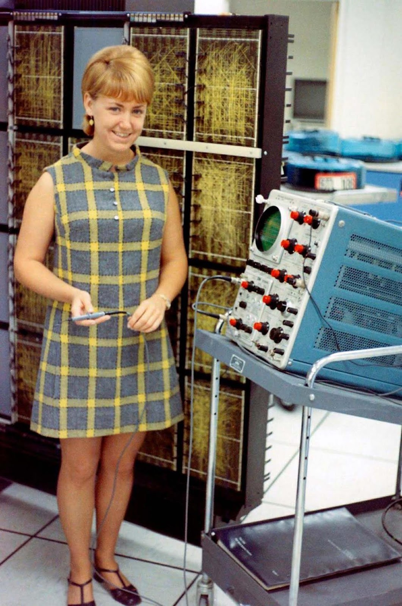
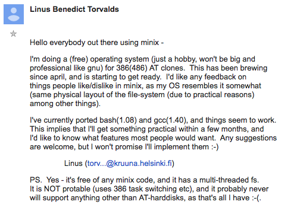

# CSCI 111: Introduction to Computer Science

---

# Overview of Today’s Topics
- History of UNIX and Linux
- Practical Linux Commands for the Lab
- Problem Solving with Algorithms

---

# Why UNIX/Linux Matters in Computer Science
- Backbone of modern operating systems
- Powers servers, desktops, and embedded systems
- Open-source and customizable

---

# Objectives for Today
- Understand the history of UNIX/Linux
- Master the use of grep for lab assignments
- Practice algorithmic problem-solving

---

# History of UNIX, Linux, and Bell Labs

- Bell Labs: A research powerhouse in the 20th century

<div class="flex">
  
  
  
</div>

---

# Bell Labs Contributions and Contributors

- **Ken Thompson**: Creator of UNIX, contributed to the development of the B programming language.
- **Dennis Ritchie**: Developed the C programming language, co-created UNIX alongside Thompson.
- **Brian Kernighan**: Coined the term "UNIX," co-author of *The C Programming Language* book, and helped develop several utilities and languages (e.g., AWK).
- **Claude Shannon**: Father of information theory, which laid the groundwork for digital computing and communications.
- **John Bardeen, William Shockley, and Walter Brattain**: Co-inventors of the transistor, revolutionizing electronics and computing.
- **Richard Hamming**: Developed Hamming codes, essential for error detection and correction in data transmission.
- **Edwin Howard Armstrong**: Pioneer in FM radio technology, which influenced telecommunications.
- **John Tukey**: Coined the term "bit" for binary digit and contributed to the development of statistical methods.

---

# UNIX in Academia and Industry
- Widely adopted in universities and companies
- Influence on modern operating systems
    - Linux
    - FreeBSD/OpenBSD
    - macOS

<div style="position: absolute; bottom: 2%; right: 4%; width: 60%;">
  
</div>

---

# The Birth of Linux by Linus Torvalds
- Linus Torvalds created Linux in 1991
- Built as a free, open-source operating system


---

# The Open-Source Movement
- Linux: cornerstone of the open-source community
- GNU, Free Software Foundation, and licensing


---

# UNIX/Linux in Modern Computing
- Powers the majority of web servers
- Linux on desktops, phones (Android), IoT devices

---

# Development of the C Programming Language
- Ritchie’s C enabled portability of UNIX
- Basis for many modern languages (C++, Java)

---

# UNIX and the Internet
- TCP/IP protocols helped UNIX systems communicate
- Crucial to early Internet infrastructure

---

# Wrap-Up of the Historical Section
- UNIX and Linux are the foundation of modern computing

---

# Reintroduction to Grep and Its Importance in the Lab
- Grep: Command-line utility for searching text
- Helps filter and locate data in files

---

# Basic Usage of Grep: Searching for Patterns
```bash
grep "pattern" filename
```

---

# Case-Insensitive Searches: Using -i Flag
```bash
grep -i "pattern" filename
```
- Useful for finding patterns regardless of case

---

# Recursive Searching in Directories: Using -r Flag
```bash
grep -r "pattern" /directory/path
```

---

# Combining Grep with Other Commands (Pipes, etc.)
```bash
cat file.txt | grep "pattern"
```

---

# Using Grep to Search Multiple Files
```bash
grep "pattern" *.txt
```

---

# Practical Examples for the Lab Assignment
- Searching for specific keywords in log files
- Filtering results to find errors or issues

---

# Advanced Grep Use Cases
- Use with `awk`, `sed` for more complex parsing

---

# Overview of the Linux File System
- Hierarchical directory structure
- Root (`/`) as the starting point

---

# Navigating Directories with Commands (ls, cd, mkdir)
```bash
ls
cd directory
mkdir new_folder
```

---

# ASCII Representation of Directories (Tree Diagram)
```
/home
  ├── user
  │   ├── documents
  │   ├── downloads
  ├── etc
```

---

# Understanding Directory Structure for Projects
- Organize files logically for easier navigation

---

# Example: Organizing Files and Folders
- Use meaningful names for directories and files
- Keep code, data, and reports separate

---

# Problem-Solving with Algorithms

---

# Overview of Algorithmic Problem Solving
- Define the problem clearly
- Break it down into smaller tasks

---

# Steps in Solving an Algorithmic Problem
1. Understand the problem
2. Plan your approach
3. Execute step-by-step
4. Test and debug

---

# Example Problem: Ordering Food from a Delivery App

## Attempt 1: The Naive Approach

- **Problem**: Order food from a delivery app.
- **Steps**:
    1. Open the app.
    2. Select a restaurant.
    3. Choose a meal.
    4. Place the order.

---

# Naive Approach: Issues

- **Issues with this Approach**:
    - What if the app requires you to log in first?
    - What if the restaurant is closed?
    - How do you choose a meal if there are too many options?
    - What if you don’t have enough money to place the order?

---

# Attempt 2: The Detailed Approach

- **Problem**: Order food from a delivery app with explicit detail to account for every possible condition.

---

- **Detailed Steps**:
    1. Unlock your phone and navigate to the app.
    2. If prompted, log into your account using your email and password.
    3. Check if you have a stable internet connection; retry if needed.
    4. Browse the restaurant list. If your preferred restaurant is closed, choose another option.
    5. Check your budget before selecting a meal.
    6. Choose a meal based on your preferences.
        - If you have dietary restrictions, filter for available options.
    7. Add your selected meal to the cart.
    8. Review your order for accuracy.
    9. Check if there are any available discounts or promotions.
    10. Enter your delivery address.
    11. Confirm your payment method and ensure it has sufficient funds.
    12. Place the order.
    13. Wait for the confirmation and track the delivery status.

---

# Why This Detailed Approach Works

- **Why This Approach Works**:
    - It accounts for possible edge cases (e.g., app login, budget, internet issues).
    - It ensures the algorithm works even under unexpected conditions.
    - More explicit steps mean fewer chances of failure.

---

# Breaking Down the Problem into Steps
- Step-by-step approach to problem-solving

---


# Algorithm Group Activity

- Break into groups
- Work on a small algorithm task

---

# Choose a Creative Algorithm to Develop  
Each group will select one of the following algorithm challenges. Break the problem into logical steps and write down your solution!

1. Make a Peanut Butter and Jelly Sandwich  
2. Plan a Road Trip Across the USA  
3. Design a Couch Potato Workout  
4. Pack for a Vacation to Mars  
5. Teach an Alien to Use a Microwave  
6. Navigate a Maze Blindfolded  
7. Survive a Zombie Apocalypse  
8. Time Travel to Fix a Historical Mistake  
9. Design a Robot Butler for Your Dorm Room  
10. Build the Ultimate Snow Fort

---

# Make a Peanut Butter and Jelly Sandwich

- **Scenario**: You’re in a fully stocked kitchen, but you’ve never made a sandwich before.
- **Inputs**: Bread, peanut butter, jelly, knife, and two hands.
- **Output**: A perfectly made PB&J sandwich.
- **Constraints**: You must describe each step in detail, from opening jars to spreading peanut butter evenly.
- **Goal**: Create the most foolproof step-by-step algorithm that anyone (or anything) can follow to make the sandwich.

---

# Plan a Road Trip Across the USA

- **Scenario**: You and your friends have one month to explore the United States by car.
- **Inputs**: A list of must-see cities, your car's fuel range, available travel time, and budget for fuel and lodging.
- **Output**: A complete itinerary that optimizes travel distance, costs, and time at each stop.
- **Constraints**: You can only drive 8 hours per day, and fuel stops must be made every 300 miles.
- **Goal**: Plan a route that balances fun, sightseeing, and rest, while ensuring you don’t run out of fuel!

---

# Design a Couch Potato Workout

- **Scenario**: Your friend never leaves the couch but wants to get fit.
- **Inputs**: Couch, remote control, a bag of chips, TV, and the couch potato.
- **Output**: A workout routine that can be done entirely on the couch.
- **Constraints**: The person cannot leave the couch or stop watching TV for more than 30 seconds.
- **Goal**: Develop a workout algorithm that improves fitness without disrupting the couch potato lifestyle (e.g., couch dips, leg raises, arm curls with the remote).

---

# Pack for a Vacation to Mars

- **Scenario**: You’re going on a one-year vacation to Mars, and you can only pack one suitcase.
- **Inputs**: Spacesuit, oxygen tanks, limited suitcase space, and a list of essential/non-essential items.
- **Output**: A perfectly packed suitcase that ensures survival and entertainment for the entire year.
- **Constraints**: The suitcase can only weigh 50 lbs. and you must prioritize items for both survival and boredom prevention.
- **Goal**: Pack your suitcase in a way that balances survival essentials (like oxygen and food) with entertainment and comfort.

---

# Teach an Alien to Use a Microwave

- **Scenario**: A friendly alien from a technologically primitive planet wants to heat up frozen pizza but has never seen a microwave before.
- **Inputs**: Alien, frozen pizza, microwave, and basic alien knowledge of Earth's food.
- **Output**: A step-by-step algorithm that the alien can follow to heat the pizza without blowing up the microwave.
- **Constraints**: You must explain each step very clearly (e.g., how to press buttons, how long to cook, what the beeping means).
- **Goal**: Ensure the alien can safely operate the microwave and enjoy a hot meal.

---

# Navigate a Maze Blindfolded

- **Scenario**: You’re trapped in a maze and must guide your blindfolded friend through it.
- **Inputs**: A maze layout, start and end points, and your blindfolded friend.
- **Output**: A detailed set of instructions to guide the friend to the exit.
- **Constraints**: Your instructions must account for possible obstacles or wrong turns.
- **Goal**: Create an algorithm that guarantees your friend can exit the maze without getting lost.

---

# Survive a Zombie Apocalypse

- **Scenario**: Zombies have taken over the city, and you need to escape to the nearest safe zone.
- **Inputs**: Zombie locations, safe houses, weapons available, and your current health status.
- **Output**: A survival route that maximizes your chance of getting to safety.
- **Constraints**: You can only carry two weapons, and zombies will move towards you every 10 minutes. Safe houses are scattered, but only a few are truly safe.
- **Goal**: Devise an escape plan that avoids zombies, maximizes survival, and gets you to the safe zone with minimal encounters.

---

# Time Travel to Fix a Historical Mistake

- **Scenario**: You’re a time traveler tasked with going back to a specific point in history to prevent a major mistake from happening.
- **Inputs**: A list of key historical events, your time machine's range, and the specific mistake to correct.
- **Output**: A sequence of actions to fix the mistake without disrupting the timeline too much.
- **Constraints**: You can only make one significant change without causing unintended consequences (butterfly effect). You also need to return to the present without being noticed.
- **Goal**: Develop a detailed plan to intervene in history at the right moment and correct the mistake while minimizing ripple effects.

---

# Design a Robot Butler for Your Dorm Room

- **Scenario**: You’ve just received a robot butler to help you with tasks in your dorm room, but you need to program it to complete its tasks efficiently.
- **Inputs**: Robot, a list of tasks (cleaning, organizing, cooking, etc.), and your dorm room layout.
- **Output**: A step-by-step algorithm that tells the robot what to do and when.
- **Constraints**: The robot can only complete three tasks per hour and has limited battery life, requiring charging breaks.
- **Goal**: Design an efficient algorithm that prioritizes important tasks while ensuring the robot doesn’t run out of battery.

---

# Build the Ultimate Snow Fort

- **Scenario**: Winter is coming, and you need to build the ultimate snow fort to protect yourself in a snowball fight.
- **Inputs**: Snow blocks, shovel, your teammates, and snowball stash.
- **Output**: A detailed fort plan, including defensive walls, snowball storage, and escape tunnels.
- **Constraints**: You have limited time and snow, and your fort must withstand incoming snowballs.
- **Goal**: Build a snow fort that offers the best defense and strategic advantage in a snowball fight.

---

# Recap of Algorithmic Thinking
- Think logically
- Solve problems step-by-step

---

# Wrap-Up

# Key Takeaways from the Lecture
- History of UNIX and Linux
- Mastery of grep and Linux directories
- Algorithmic problem solving

---

# Group Discussion
- What part of UNIX/Linux history surprised you?
- What commands were most useful in the lab?

---

# Q&A on Linux and Problem Solving
- Open forum for questions
