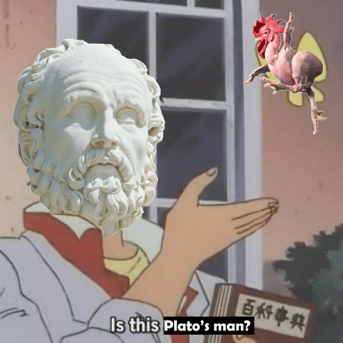
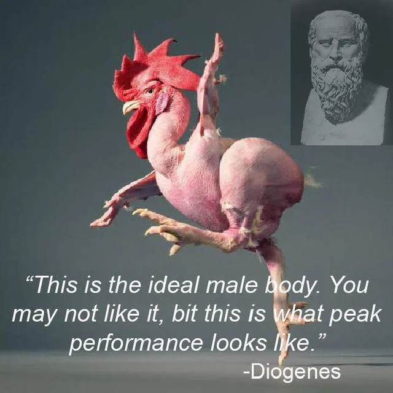

# CSCI 111: Introduction to Computer Science

---

# Classes and Objects in Python
## Your First Step into Object-Oriented Programming

---

# Why Do We Need Classes?
- Organize related data and functions together
- Model real-world entities in code
- Create reusable and modular code
- Example: Managing multiple students in a school system

---

# Platonic Forms: The Ideal Class
- Plato's Theory of Forms: The idea of perfect, abstract concepts
- Forms represent the ideal, unchanging essence of things
- Physical objects are imperfect instances of these ideal forms

<div style="position: absolute; bottom: 2%; right: 0%; width: 50%;">
  
</div>

---

# From Abstract to Concrete: Classes and Objects
- Classes in programming are like Platonic forms
  - They represent the ideal, abstract concept
- Objects are like physical instances in Plato's theory
  - Concrete representations of the abstract idea

---

# Example: The Ideal "Car"
- The Platonic form of a "Car":
  - Abstract concept with essential properties (wheels, engine, etc.)
- Physical cars:
  - Instances of the "Car" form, each with unique characteristics

---

# Classes as Digital Platonic Forms
- A `Car` class in Python:
  - Defines the essential attributes and behaviors of a car
- Car objects:
  - Specific instances with unique values for those attributes

---


# Thinking About Forms: What Makes a Chair?

- **Class Discussion**: What would be the essential properties of the "Chair" form?

---

# Thinking About Forms: What Makes a Chair?

- **Class Discussion**: What would be the essential properties of the "Chair" form?

<div class="flex">
  
  
  
</div>

---

# Thinking About Forms: What Makes a Chair?

- **Plato**: "A man is a featherless biped"

- **Diogenes**: "Behold, a man!"

<div style="position: absolute; bottom: 2%; right: 0%; width: 50%;">
  
</div>

---

# Thinking About Forms: What Makes a Chair?

- **Plato**: "A man is a featherless biped"

- **Diogenes**: "Behold, a man!"

<div style="position: absolute; bottom: 2%; right: 0%; width: 50%;">
  
</div>

<div style="position: absolute; bottom: 2%; right: 45%; width: 40%;">
  
</div>

---

# Why This Matters in Programming
- Classes help us model ideal concepts in code
- Objects allow us to work with specific instances of these concepts
- This abstraction makes our code more organized and reusable

---

# Think About It: Student Information
How would you store information for multiple students?

```python
# Without classes (cumbersome for multiple students)
student1_name = "Alice"
student1_age = 20
student1_grade = 95

student2_name = "Bob"
student2_age = 21
student2_grade = 88

# ... and so on for each student
```

---

# Introducing Classes: A Better Way
- Classes are like blueprints or templates
- They define a new type of object
- Objects are instances of a class

```python
class Student:
    def __init__(self, name, age, grade):
        self.name = name
        self.age = age
        self.grade = grade

# Now we can create student objects easily
student1 = Student("Alice", 20, 95)
student2 = Student("Bob", 21, 88)
```

---

# What's Happening Here?
- `class Student:` defines a new class named Student
- `__init__` is a special method (constructor) that initializes new objects
- `self` refers to the object being created
- We create objects by calling the class like a function

---

# The Magic of `self`
- `self` is a reference to the current instance of the class
- It's how an object knows about its own data
- Always the first parameter in method definitions
- Used to access the object's attributes and methods

```python
class Student:
    def __init__(self, name, age):
        self.name = name  # Creating attributes
        self.age = age

    def introduce(self):
        return f"Hi, I'm {self.name} and I'm {self.age} years old."

alice = Student("Alice", 20)
print(alice.introduce())  # Output: Hi, I'm Alice and I'm 20 years old.
```

---

# Creating and Using Objects
- Objects are instances of a class
- We can create multiple objects from one class
- Each object has its own set of attributes

```python
# Creating objects
alice = Student("Alice", 20)
bob = Student("Bob", 21)

# Using objects
print(alice.name)  # Output: Alice
print(bob.age)     # Output: 21
```

---

# Classes as Black Boxes
- Classes encapsulate complexity
- Users of a class don't need to know how it works internally
- They just need to know how to use it
- This is called abstraction

---

# The Four Pillars of OOP
1. Encapsulation
2. Inheritance
3. Polymorphism
4. Abstraction

We'll explore each of these in detail.

---

# Encapsulation: Keeping Data Safe
- Encapsulation is about bundling data and methods that work on that data within a single unit (class)
- It's also about restricting direct access to some of an object's components

---

# Why Do We Need Encapsulation?
Consider this example:

```python
class BankAccount:
    def __init__(self, balance):
        self.balance = balance

account = BankAccount(1000)
print(account.balance)  # Output: 1000

# Uh oh, we can change the balance directly!
account.balance = 1000000
print(account.balance)  # Output: 1000000
```

---

# Encapsulation: Private Variables
- In Python, we use double underscores (__) to make attributes private
- Private attributes can't be accessed directly from outside the class

```python
class BankAccount:
    def __init__(self, balance):
        self.__balance = balance  # Private attribute

account = BankAccount(1000)
print(account.__balance)  # This will raise an AttributeError
```

---

# Getters and Setters
- Methods that allow controlled access to private attributes
- Getters retrieve the value of a private attribute
- Setters modify the value of a private attribute

```python
class BankAccount:
    def __init__(self, balance):
        self.__balance = balance

    def get_balance(self):  # Getter
        return self.__balance

    def set_balance(self, amount):  # Setter
        if amount >= 0:
            self.__balance = amount
        else:
            print("Balance cannot be negative")

account = BankAccount(1000)
print(account.get_balance())  # Output: 1000
account.set_balance(2000)
print(account.get_balance())  # Output: 2000
account.set_balance(-500)  # Output: Balance cannot be negative
```

---

# Inheritance: Building on Foundations
- Inheritance allows a new class to be based on an existing class
- The new class (child) inherits attributes and methods from the existing class (parent)
- It promotes code reuse and establishes a hierarchy

---

# Inheritance Example: Types of Students
```python
class Student:
    def __init__(self, name, age):
        self.name = name
        self.age = age

    def introduce(self):
        return f"Hi, I'm {self.name} and I'm {self.age} years old."

class GraduateStudent(Student):
    def __init__(self, name, age, research_topic):
        super().__init__(name, age)  # Call the parent class's __init__
        self.research_topic = research_topic

    def introduce(self):
        return f"{super().introduce()} I'm researching {self.research_topic}."

grad_student = GraduateStudent("Alice", 25, "Computer Science")
print(grad_student.introduce())
# Output: Hi, I'm Alice and I'm 25 years old. I'm researching Computer Science.
```

---

# Polymorphism: Many Forms, One Interface
- Polymorphism allows objects of different classes to be treated as objects of a common parent class
- It provides a way to use a class exactly like its parent, but with its own specific implementation

---

# Polymorphism Example: Different Types of Students
```python
class Student:
    def study(self):
        return "Studying general subjects"

class ArtStudent(Student):
    def study(self):
        return "Studying art history and techniques"

class ScienceStudent(Student):
    def study(self):
        return "Studying scientific theories and conducting experiments"

def school_day(student):
    print(student.study())

alice = ArtStudent()
bob = ScienceStudent()

school_day(alice)  # Output: Studying art history and techniques
school_day(bob)    # Output: Studying scientific theories and conducting experiments
```

---

# Abstraction: Simplifying Complexity
- Abstraction involves hiding complex implementation details and showing only the necessary features of an object
- It reduces complexity by hiding unnecessary details from the user
- Classes themselves are a form of abstraction!

---

# Abstraction Example: A Simple Game Character
```python
class GameCharacter:
    def __init__(self, name, health):
        self.name = name
        self.__health = health

    def take_damage(self, amount):
        self.__health -= amount
        if self.__health < 0:
            self.__health = 0

    def heal(self, amount):
        self.__health += amount

    def is_alive(self):
        return self.__health > 0

# Users of this class don't need to know how health is managed internally
hero = GameCharacter("Super Hero", 100)
hero.take_damage(30)
hero.heal(10)
print(hero.is_alive())  # Output: True
```

---

# Practical Exercise: Library System
Design classes for a simple library system:
1. `Book` class (attributes: title, author, is_checked_out)
2. `Library` class (attributes: name, books [list of Book objects])

Implement methods like `check_out_book()`, `return_book()`, `display_available_books()`

---

# Recap of Key Concepts
- Classes as blueprints, objects as instances
- The four pillars of OOP: Encapsulation, Inheritance, Polymorphism, and Abstraction
- Private attributes and the use of getters and setters
- The role of `self` in Python classes
- Creating and using objects
- Inheritance and method overriding

---

# Why OOP Matters
- Organizes code into reusable structures
- Models real-world relationships
- Enhances code maintainability and scalability
- Facilitates teamwork in large projects

---

# Looking Ahead
- More advanced OOP concepts
- How OOP is used in real-world applications
- Object-Oriented Design principles

---

# Practice Makes Perfect
- Experiment with creating your own classes
- Try modeling real-world objects and their relationships
- Don't be afraid to make mistakes - they're part of learning!