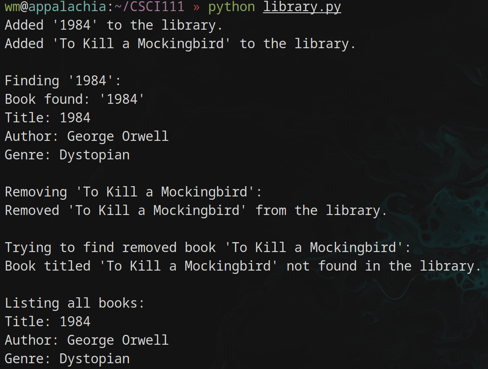

# CSCI 111: Introduction to Computer Science

---

# Review of Key Concepts

---

# Introduction to Computer Science
- **What is Computer Science?**
  - Exploration of computer science as a field and its impacts on society.
  - Discussion on whether computer science qualifies as a true science.

---

# UNIX and Linux Fundamentals
- **The UNIX Philosophy**
  - History and impact of UNIX/Linux in computing.
  - Key UNIX/Linux commands and their practical applications.
- **Using `grep`**
  - Practical demonstration of using `grep` for pattern searching.

---

# Programming Basics in Python
- **Python Syntax and Setup**
  - Introduction to Python and setting up the environment.
- **Variables and Data Types**
  - Overview of Python variables, data types, and basic input/output operations.

---

# Control Structures
- **Conditional Statements**
  - How to use `if`, `elif`, and `else` statements.
- **Loops and Iterations**
  - Detailed exploration of `for` and `while` loops and their appropriate use cases.

---

# Functions and Modular Programming
- **Defining Functions**
  - How to define and call functions; understanding parameters and return values.
- **Scope and Lifetime of Variables**
  - Local vs global scope and the lifetime of variables within these scopes.**

---

# Error Handling and Debugging
- **Common Python Errors**
  - Types of common errors: syntax errors, runtime errors, and logical errors.
- **Effective Debugging Techniques**
  - Strategies for debugging Python code, including print debugging.

---

# Introduction to Object-Oriented Programming
- **Core Concepts of OOP**
  - Classes, objects, inheritance, encapsulation, and polymorphism.
- **Classes and Objects**
  - How to define classes and create objects in Python.

---

# The Philosophy of OOP
- **Platonic Forms**
  - Discussion on Platonic forms as a way to conceptualize classes and objects.
  - What is a chair?
---

# Advanced OOP Features
- **Inheritance and Encapsulation**
  - How to implement inheritance; understanding base and derived classes.
- **Polymorphism**
  - How it can be implemented in Python.

---

# Interface vs. Implementation

---

# What is an Interface?

- Definition: An interface specifies what methods a class should implement but does not dictate how the methods should be implemented.
- Analogy: Think of an interface as a contract or a set of rules that a class agrees to follow.

---

# What is Implementation?

- Definition: Implementation refers to the actual code that fulfills the contract specified by the interface.
- Analogy: If the interface is the blueprint, the implementation is the actual building constructed from that blueprint.

---

# Black Box Model

- Concept: In software engineering, a black box represents a system where only the inputs and outputs are visible or known. The internal workings or the implementation are hidden.
- Benefit: This model helps in understanding the separation between how something is done and what is done.

---

# Example: Calculator

## Interface (Calculator)

- Methods:
  - `add(a, b)`
  - `subtract(a, b)`
  - `multiply(a, b)`
  - `divide(a, b)`

---

# Example: Calculator

## Implementation (SimpleCalculator)

```python
class SimpleCalculator:
    def add(self, a, b):
        return a + b

    def subtract(self, a, b):
        return a - b

    def multiply(self, a, b):
        return a * b

    def divide(self, a, b):
        if b != 0:
            return a / b
        else:
            return 'Cannot divide by zero'
```

---

# Exercise: Library Management System

---

# Objective

- Create a simplified library management system that manages books and their availability.

---

# Classes and Required Methods

## **Book**
- **Attributes:**
  - `title` (string): The title of the book.
  - `author` (string): The author of the book.
- **Methods:**
  - `__init__(self, title, author)`: Constructor to initialize a new book object with a title and author.
  - `display_info(self)`: Method to display the information about the book.

---

# Classes and Required Methods

## **Library**
- **Attributes:**
  - `collection` (list): A list to hold all the book objects in the library.
- **Methods:**
  - `__init__(self)`: Constructor to initialize the library with an empty collection of books.
  - `add_book(self, book)`: Adds a new book to the library.
    - `book`: The `Book` object to be added to the library.
  - `remove_book(self, title)`: Removes a book from the library by its title.
    - `title`: The title of the book to be removed.
  - `find_book(self, title)`: Finds a book by its title and returns it.
    - `title`: The title of the book to find.
  - `list_books(self)`: Returns a list of all books currently in the library, formatted as strings.

---

# Example Output

<br>

<div style="text-align: center; display: flex; justify-content: center; align-items: center;">
    
</div>
---

# Requirements

- **Classes to Implement**:

  - `Book`: Represents a book with basic attributes.
  - `Library`: Manages the inventory of books.

# Teams

- **Form Small Teams (3-4 Students)**

  - Collaborate briefly to design and implement the system.


# Deliverable

- **Develop a Simple Library System**

  - Use basic Object-Oriented Programming concepts to create a system for managing a library's book inventory.

---
